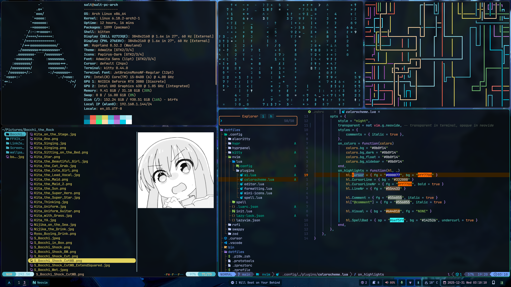

# Salt's dotfiles




## Installation

> [WARNING] Before using the dotfiles or configs, fork this repository first,
> review the scripts and settings and do the customization before applying them.
> You should know what your are doing before the installation and use it at your own risk.

### Use the installation script

You can run the following command to install the dotfiles and configs. Please note that `git` is required for the install.

```bash
curl -fsSL https://raw.githubusercontent.com/saltchang/dotfiles/HEAD/install.sh | sh -
```

To update or re-install, `cd` into your cloned `dotfiles` directory and run:

```bash
./install.sh
```

## Customize Your zsh

Run the below command to open your `.zshrc`:

```bash
edit-rc
```

Or use the shortcut to go to the `dotfiles` repo:

```bash
cddf # stands for change directory to dotfiles
```

Then you can start to customize your shell.

## Color for powerlevel10k

If you would like to customize the color scheme of powerlevel10k, please see [This chart](https://user-images.githubusercontent.com/704406/43988708-64c0fa52-9d4c-11e8-8cf9-c4d4b97a5200.png).

## Dependencies for Arch

If you are using Arch, see the [README_ARCH.md](./README_ARCH.md) about the dependency list.

## Image Credits

- `.config/rofi/Tower.jpg` (Rofi Background) - [@alzimi](https://x.com/ALumizky)


- `.config/hyprpanel/avatar.jpg` (Avatar) - [Bocchi the Rock!](https://bocchi.rocks)


- `.config/hypr/wallpapers/Spring_of_Power.jpg` (Wallpaper 1) - [@joanne](https://x.com/_joannetran)


- `.config/hypr/wallpapers/BOTW_1.jpg` (Wallpaper 2) - [PhilomathBOT](https://www.reddit.com/r/PhotoshopRequest/comments/r3fld6/can_someone_remove_that_big_fat_text_saying_the)


- `.config/hypr/wallpapers/BOTW_2.jpg` (Wallpaper 3) - [Sephiroth508](https://www.reddit.com/r/NintendoSwitch/comments/85clu3/made_a_botw_vector_wallpaper_4k)


## License

[MIT](./LICENSE)

